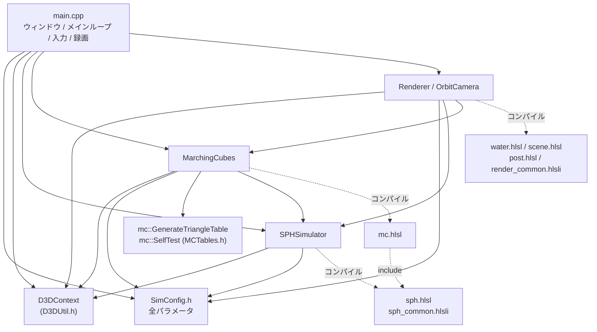
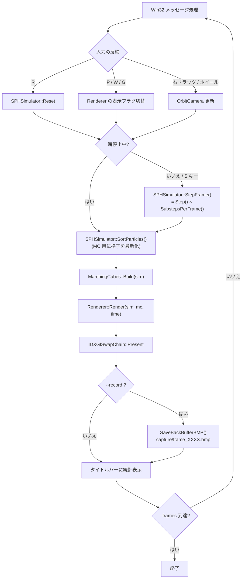
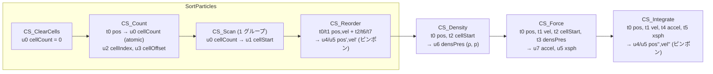
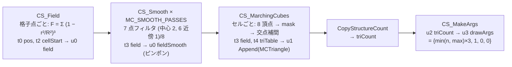
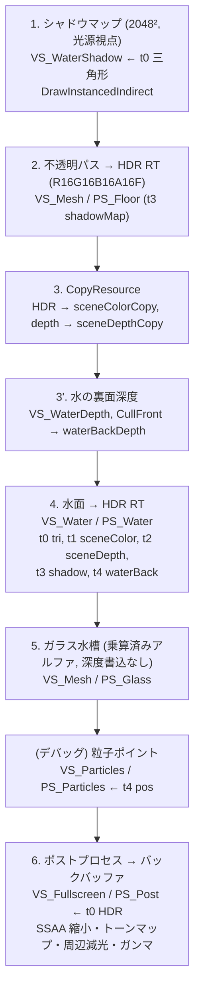
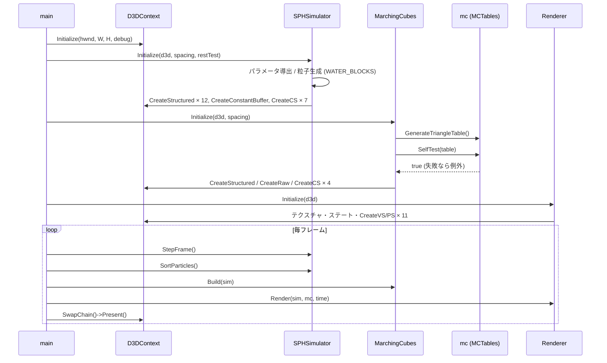

# SPH 水しぶきシミュレーション API 仕様書

対象: `E:\work\水しぶき` (DirectX 11 / C++17 / HLSL 5.0)
版: 1.0 (2026-09-12)

本書は C++ モジュールの公開 API、HLSL シェーダーのエントリポイントとリソース束縛、
およびそれらがどの順序で呼ばれるかのフローをまとめたものです。
数値パラメータの既定値は `src/SimConfig.h` を正とします。

---

## 1. 全体構成

### 1.1 モジュール依存関係



### 1.2 1 描画フレームの流れ

1 描画フレーム = 動画の 1/24 秒 (`cfg::FRAME_DT`)。物理時間は実時間に依存せず固定ステップで進みます。



---

## 2. コマンドラインとキー操作 (main.cpp)

### 2.1 コマンドライン

| オプション | 引数 | 既定 | 説明 |
|---|---|---|---|
| `--spacing` | 粒子間隔 [m] | `0.014` | 小さいほど粒子数が増え高精細 (粒子数 ∝ 1/spacing³) |
| `--record` | 保存先ディレクトリ (省略可) | `capture` | 各フレームを 24bit BMP で連番保存 |
| `--frames` | フレーム数 | 無制限 | 指定フレーム描画後に自動終了 |
| `--particles` | なし | – | 粒子を点で表示するデバッグモードで開始 |
| `--resttest` | なし | – | 水塊 A を床に静置する安定性テストシーン |
| `--debug` | なし | – | D3D11 デバッグレイヤーを有効化 |

### 2.2 キー操作

| キー | 動作 |
|---|---|
| Space | 一時停止 / 再開 |
| S | 1 フレーム進める |
| R | 初期状態へリセット |
| P | 粒子ポイント表示の切替 |
| W | 水面メッシュ表示の切替 |
| G | ガラス水槽表示の切替 |
| 右ドラッグ | カメラ回転 (ヨー / ピッチ) |
| ホイール | ズーム |
| Esc | 終了 |

---

## 3. D3DUtil.h — DirectX 11 ユーティリティ

### 3.1 `ThrowIfFailed(HRESULT hr, const char* what)`
`FAILED(hr)` のとき `std::runtime_error("<what> failed (hr=0x....)")` を送出します。

### 3.2 `struct GpuBuffer`

| メンバ | 型 | 説明 |
|---|---|---|
| `buffer` | `ComPtr<ID3D11Buffer>` | バッファ本体 |
| `srv` | `ComPtr<ID3D11ShaderResourceView>` | 読み取り用ビュー (t#) |
| `uav` | `ComPtr<ID3D11UnorderedAccessView>` | 読み書き用ビュー (u#) |
| `count` | `UINT` | 要素数 |
| `stride` | `UINT` | 要素サイズ [byte] |

### 3.3 `class D3DContext`

| メソッド | 説明 |
|---|---|
| `void Initialize(HWND hwnd, int width, int height, bool debugLayer)` | デバイス・スワップチェーン (R8G8B8A8, 2 バッファ) 生成。シェーダーディレクトリを `<exe>/shaders/` → `<exe>/../shaders/` → `shaders/` の順に探索 |
| `ID3D11Device* Device()` / `ID3D11DeviceContext* Context()` / `IDXGISwapChain* SwapChain()` | 生オブジェクトへのアクセサ |
| `ID3D11RenderTargetView* BackBufferRTV()` / `ID3D11Texture2D* BackBuffer()` | バックバッファ |
| `int Width()` / `int Height()` | バックバッファ解像度 |
| `GpuBuffer CreateStructured(UINT stride, UINT count, const void* initData = nullptr, bool append = false)` | 構造化バッファ + SRV/UAV。`append=true` で Append カウンタ付き UAV |
| `GpuBuffer CreateRaw(UINT byteSize, bool indirectArgs = false)` | ByteAddressBuffer + RAW SRV/UAV。`indirectArgs=true` で `DrawInstancedIndirect` 引数用 |
| `ComPtr<ID3D11Buffer> CreateConstantBuffer(UINT byteSize)` | 動的定数バッファ (16 byte 境界に切り上げ) |
| `ComPtr<ID3D11Buffer> CreateVertexBuffer(const void* data, UINT byteSize)` | 静的 (IMMUTABLE) 頂点バッファ |
| `void UpdateConstantBuffer(ID3D11Buffer* cb, const void* data, UINT byteSize)` | `Map(WRITE_DISCARD)` で更新 |
| `ComPtr<ID3DBlob> CompileShader(const std::wstring& file, const char* entry, const char* target)` | `D3DCompileFromFile`。失敗時はエラー文を stderr に出して例外 |
| `CreateCS / CreateVS / CreatePS(file, entry[, outBlob])` | `cs_5_0` / `vs_5_0` / `ps_5_0` でコンパイルして生成。`CreateVS` は入力レイアウト用に blob を返せる |
| `void UnbindCompute()` | CS の t0–t7 / u0–u7 を全て解除 (SRV/UAV 競合防止) |
| `const std::wstring& ShaderDir()` | 解決済みシェーダーディレクトリ |

---

## 4. SPHSimulator — GPU WCSPH

### 4.1 `struct SimParams` (定数バッファ `b0`、HLSL の `cbuffer SimParams` と完全一致)

| メンバ | 型 | 意味 |
|---|---|---|
| `domainMin[3]`, `cellSize` | float | 領域最小 / 格子セル幅 (= h) |
| `domainMax[3]`, `h` | float | 領域最大 / 平滑化長 |
| `gridDim[3]`, `numCells` | uint | 格子分割数 / 総セル数 |
| `h2`, `mass` | float | h² / 粒子質量 (格子上で ρ0 になるよう自動決定) |
| `restDensity`, `taitB` | float | ρ0 / Tait 剛性 B = ρ0 c² / γ |
| `viscosity`, `xsphEps` | float | 粘性 μ / XSPH 係数 |
| `dt`, `gravity` | float | サブステップ時間 / 重力 (フルード相似で 1/SCENE_SCALE) |
| `poly6`, `spikyGrad`, `viscLap` | float | カーネル正規化定数 |
| `tankInner`, `tankOuter`, `tankHeight`, `tankFloorY`, `floorY` | float | 水槽と床の形状 |
| `restitution`, `friction` | float | 壁の反発係数 / 接触中の接線減衰 |
| `maxSpeed`, `boundaryDensityScale` | float | 速度上限 / 境界密度補正の強さ |
| `numParticles` | uint | 粒子数 |
| `artificialAlpha`, `cohesion`, `soundSpeed` | float | Monaghan 人工粘性 α / 凝集力 κ / 数値音速 c |

### 4.2 `class SPHSimulator`

| メソッド | 説明 |
|---|---|
| `void Initialize(D3DContext& d3d, float spacing, bool restTest = false)` | パラメータ導出 (h = 2·spacing, dt = CFL·h/c からサブステップ数決定)、`cfg::WATER_BLOCKS` から粒子生成、GPU バッファとシェーダー生成 |
| `void Reset()` | 初期位置・速度 0 を再アップロード、時刻 0 |
| `void SortParticles()` | 格子構築 (Clear → Count → Scan → Reorder) のみ実行。ピンポンバッファが入れ替わる |
| `void Step()` | 1 サブステップ (SortParticles → Density → Force → Integrate) |
| `void StepFrame()` | `Step()` を `SubstepsPerFrame()` 回 |
| `uint32_t NumParticles()` / `SubstepsPerFrame()` / `float SubstepDt()` / `float SimTime()` | 統計・状態 |
| `const SimParams& Params()` | 現在のパラメータ |
| `ID3D11Buffer* ParamsCB()` | 定数バッファ (MC が `b0` に束縛して再利用) |
| `ID3D11ShaderResourceView* PositionSRV()` | 現在の位置バッファ (`float4` × N、直近のソート順) |
| `ID3D11ShaderResourceView* CellStartSRV()` | セル先頭インデックス (`uint` × numCells+1) |

> **前提条件**: `PositionSRV()` と `CellStartSRV()` を近傍探索に使う側 (MC) は、直前に `SortParticles()` を呼び格子と位置の整合を取ること。`Step()` 末尾の Integrate 後は位置が動いているため、そのままでは格子と一致しない。

### 4.3 サブステップのパイプライン (sph.hlsl)



各パスの物理:

| パス | 内容 |
|---|---|
| CS_Density | ρᵢ = m Σ W_poly6 + 境界ゴースト密度、p = max(0, B((ρ/ρ0)⁷ − 1)) |
| CS_Force | 圧力項 −Σ m (pᵢ/ρᵢ² + pⱼ/ρⱼ²) ∇W_spiky、粘性項 μ Σ m (vⱼ−vᵢ)/ρⱼ ∇²W_visc / ρᵢ、Monaghan 人工粘性 (接近対のみ)、凝集力 −κ Σ (xᵢ−xⱼ) W_poly6、XSPH Σ (m/ρⱼ)(vⱼ−vᵢ) W_poly6、重力 |
| CS_Integrate | v += a·dt、速度上限、x += (v + ε·xsph)·dt、水槽壁 (高さ tankHeight 以下) / 床 / 領域 AABB との衝突 |

### 4.4 GPU バッファ一覧

| バッファ | 型 | 要素数 | 用途 |
|---|---|---|---|
| `m_pos[2]`, `m_vel[2]` | float4 | N | 位置・速度 (ピンポン) |
| `m_xsph` | float4 | N | XSPH 補正速度 |
| `m_accel` | float4 | N | 加速度 |
| `m_densPres` | float2 | N | 密度・圧力 |
| `m_cellIndex`, `m_cellOffset` | uint | N | 粒子の所属セル / セル内順序 |
| `m_cellCount` | uint | numCells | セル内粒子数 |
| `m_cellStart` | uint | numCells + 1 | 排他的累積和 (末尾 = N) |

---

## 5. MarchingCubes — GPU マーチングキューブ法

### 5.1 `struct MCParams` (定数バッファ `b1`)

| メンバ | 型 | 意味 |
|---|---|---|
| `origin[3]`, `cell` | float | 格子原点 / 格子間隔 (= spacing × 0.75) |
| `dim[3]`, `numVerts` | uint | 格子点数 (各軸) / 総格子点数 |
| `isoLevel`, `fieldRadius`, `fieldInvR2` | float | 等値面レベル / カーネル半径 R (= h) / 1/R² |
| `tableStride`, `maxTriangles` | uint | テーブルの 1 パターン長 (32) / 三角形バッファ容量 |

### 5.2 `class MarchingCubes`

| メソッド | 説明 |
|---|---|
| `void Initialize(D3DContext& d3d, float spacing)` | 格子設定、`mc::GenerateTriangleTable()` + `mc::SelfTest()` (失敗時は例外)、GPU リソース生成 |
| `void Build(SPHSimulator& sim)` | 現在の粒子位置からメッシュを生成 (§5.3)。**呼び出し前に `sim.SortParticles()` 済みであること** |
| `ID3D11ShaderResourceView* TriangleSRV()` | 出力三角形 (`MCTriangle` × maxTriangles) |
| `ID3D11Buffer* DrawArgs()` | `DrawInstancedIndirect` 引数 `{頂点数, 1, 0, 0}` |
| `const MCParams& Params()` | 格子パラメータ |
| `uint32_t LastTriangleCount()` | 三角形数を CPU に読み戻す (GPU 同期を伴うので統計表示用) |

### 5.3 メッシュ生成のパイプライン (mc.hlsl)



出力頂点フォーマット (`water.hlsl` と共有):

```hlsl
struct MCVertex   { float3 p; float3 n; };      // 位置, 法線 (= −∇F を正規化)
struct MCTriangle { MCVertex v0, v1, v2; };      // 72 byte、頂点順は外向き
```

### 5.4 `namespace mc` (MCTables.h)

| 要素 | 説明 |
|---|---|
| `NUM_CASES = 256`, `TABLE_STRIDE = 32` | テーブル寸法 |
| `EDGE_VERTS[12][2]` | エッジ両端の頂点番号。頂点 v の座標 = (v&1, (v>>1)&1, (v>>2)&1)、エッジ 0–3 = x、4–7 = y、8–11 = z 方向 |
| `std::vector<int32_t> GenerateTriangleTable()` | 256 パターンの三角形テーブルを生成 (エッジ番号 3 個ずつ、−1 終端)。曖昧面は「内側頂点を分離」規則で統一、ループの向きは外向き |
| `bool SelfTest(const std::vector<int32_t>& table, int32_t* outTriangleCount = nullptr)` | 球の距離場で CPU MC を実行し、閉多様体 (各有向エッジが 1 回、逆向きも 1 回) と外向きを検証 |

---

## 6. Renderer — 描画

### 6.1 `struct FrameParams` (定数バッファ `b0`、VS/PS 共通)

| メンバ | 意味 |
|---|---|
| `viewProj`, `view`, `lightViewProj` | 行列 (転置済み、HLSL は `mul(vec, M)`) |
| `cameraPos` | xyz = カメラ位置 |
| `lightDir` | xyz = 光源へ向かう単位ベクトル |
| `screenSize` | xy = 内部解像度, zw = 逆数 |
| `params` | x = 時刻, y = near, z = far |
| `tank` | x = 内側半幅, y = 外側半幅, z = 描画するガラス高さ, w = 床の高さ |

### 6.2 `struct OrbitCamera`

| メンバ / メソッド | 説明 |
|---|---|
| `target`, `yawDeg`, `pitchDeg`, `distance`, `fovDeg` | 注視点まわりの軌道カメラ |
| `XMVECTOR Eye()` | 視点位置 |
| `XMMATRIX View()` | `XMMatrixLookAtLH` |
| `XMMATRIX Proj(float aspect, float nearZ, float farZ)` | `XMMatrixPerspectiveFovLH` |

### 6.3 `class Renderer`

| メソッド / メンバ | 説明 |
|---|---|
| `void Initialize(D3DContext& d3d)` | レンダーターゲット (内部解像度 = ウィンドウ × SSAA)、メッシュ、ステート、シェーダー生成 |
| `void Render(SPHSimulator& sim, MarchingCubes& mc, float time)` | §6.4 の全パスを実行してバックバッファへ出力 (Present は呼ばない) |
| `OrbitCamera& Camera()` | カメラ (外部から編集可) |
| `bool showParticles / showWater / showGlass` | 表示フラグ |

### 6.4 描画パスの流れ



`PS_Water` の色: `lerp(屈折, 反射, フレネル) + ハイライト × 影`。
屈折 = `sceneColorCopy` を法線でずらして参照 × `exp(−厚み × absorb)`、厚み = `min(背景深度, 裏面深度) − 表面深度`。

---

## 7. HLSL リソース束縛一覧

### 7.1 定数バッファ

| スロット | 構造体 | 使用シェーダー |
|---|---|---|
| `b0` | `SimParams` | sph.hlsl, mc.hlsl (格子の再利用) |
| `b1` | `MCParams` | mc.hlsl |
| `b0` | `FrameParams` | water.hlsl, scene.hlsl, post.hlsl |

### 7.2 sph.hlsl

| 種別 | スロット | 名前 | 型 |
|---|---|---|---|
| SRV | t0 / t1 | gPosIn / gVelIn | StructuredBuffer\<float4\> |
| SRV | t2 | gCellStart | StructuredBuffer\<uint\> |
| SRV | t3 | gDensPres | StructuredBuffer\<float2\> |
| SRV | t4 / t5 | gAccel / gXsph | StructuredBuffer\<float4\> |
| SRV | t6 / t7 | gCellIndex / gCellOffset | StructuredBuffer\<uint\> |
| UAV | u0 / u1 | gCellCount / gCellStartRW | RWStructuredBuffer\<uint\> |
| UAV | u2 / u3 | gCellIndexRW / gCellOffsetRW | RWStructuredBuffer\<uint\> |
| UAV | u4 / u5 | gPosOut / gVelOut (CS_Force では XSPH 出力) | RWStructuredBuffer\<float4\> |
| UAV | u6 | gDensPresRW | RWStructuredBuffer\<float2\> |
| UAV | u7 | gAccelRW | RWStructuredBuffer\<float4\> |

エントリポイント: `CS_ClearCells`, `CS_Count`, `CS_Scan` (1024 スレッド × 1 グループ), `CS_Reorder`, `CS_Density`, `CS_Force`, `CS_Integrate` (256 スレッド/グループ)

### 7.3 mc.hlsl

| 種別 | スロット | 名前 | 型 |
|---|---|---|---|
| SRV | t0 | gPos | StructuredBuffer\<float4\> |
| SRV | t2 | gCellStart | StructuredBuffer\<uint\> |
| SRV | t3 | gField | StructuredBuffer\<float\> |
| SRV | t4 | gTriTable | StructuredBuffer\<int\> |
| UAV | u0 | gFieldRW | RWStructuredBuffer\<float\> |
| UAV | u1 | gTriangles | AppendStructuredBuffer\<MCTriangle\> |
| UAV | u2 / u3 | gTriCount / gDrawArgs | RWByteAddressBuffer |

エントリポイント: `CS_Field`, `CS_Smooth`, `CS_MarchingCubes`, `CS_MakeArgs`

### 7.4 描画シェーダー

| ファイル | エントリ | 入力 | 主なリソース |
|---|---|---|---|
| water.hlsl | `VS_Water`, `VS_WaterShadow`, `VS_WaterDepth` | `SV_VertexID` (頂点バッファ無し) | t0 gTriangles |
| water.hlsl | `PS_Water` | – | t1 gSceneColor, t2 gSceneDepth, t3 gShadowMap, t4 gWaterBack |
| water.hlsl | `VS_Particles` / `PS_Particles` | `SV_VertexID` (粒子あたり 6 頂点) | t4 gParticlePos |
| scene.hlsl | `VS_Mesh` | POSITION(float3), NORMAL(float3) | – |
| scene.hlsl | `PS_Floor` / `PS_Glass` | – | t3 gShadowMap |
| post.hlsl | `VS_Fullscreen` / `PS_Post` | `SV_VertexID` (3 頂点) | t0 gHdr |
| 共通 | – | – | s0 gLinearClamp, s1 gShadowCmp (比較サンプラ) |

---

## 8. 初期化シーケンス



---

## 9. エラーと制約

| 状況 | 挙動 |
|---|---|
| シェーダーコンパイル失敗 | `D3DContext::CompileShader` が stderr にエラー文を出力し `std::runtime_error` を送出。`main` が捕捉して MessageBox 表示後に終了コード 1 |
| MC テーブル自己検証失敗 | `MarchingCubes::Initialize` が例外 |
| 三角形数が `MC_MAX_TRIANGLES` (1,048,576) を超過 | 超過分の Append は破棄され、`CS_MakeArgs` が描画数を容量でクランプ (穴が空くが落ちない) |
| 粒子の速度超過 | `maxSpeed = 0.5 h / dt` でクランプ (爆発防止) |
| SRV/UAV の同時束縛 | 各 Dispatch 後に `UnbindCompute()` で解除する規約 |
| 機能レベル | D3D 11.0 以上 (UAV は u0–u7 の範囲のみ使用) |

---

## 10. 主要パラメータの既定値 (SimConfig.h 抜粋)

| 定数 | 値 | 意味 |
|---|---|---|
| `WINDOW_W × WINDOW_H`, `SSAA` | 1280 × 720, 2 | 出力解像度と内部倍率 |
| `VIDEO_FPS`, `FRAME_DT` | 24, 1/24 | 固定ステップ |
| `DEFAULT_SPACING`, `H_PER_SPACING` | 0.014, 2.0 | 粒子間隔, h = 2d |
| `REST_DENSITY`, `SOUND_SPEED`, `TAIT_GAMMA` | 1000, 12, 7 | 状態方程式 |
| `VISCOSITY_MU`, `ARTIFICIAL_VISC_ALPHA`, `XSPH_EPS` | 0.5, 0.08, 0.15 | 減衰項 |
| `SCENE_SCALE`, `GRAVITY` | 2.0, 9.81/2 | フルード相似 |
| `CFL` | 0.4 | dt = CFL·h/c |
| `TANK_INNER_HALF`, `TANK_HEIGHT`, `GLASS_VISIBLE_HEIGHT` | 0.5, 1.6, 0.3 | 水槽 (衝突は 1.6 まで、描画は 0.3 まで) |
| `MC_CELL_PER_SPACING`, `MC_FIELD_RADIUS_PER_SPACING`, `MC_ISO_LEVEL`, `MC_SMOOTH_PASSES` | 0.75, 2.0, 0.5, 2 | メッシュ生成 |
| `CAM_YAW_DEG`, `CAM_PITCH_DEG`, `CAM_DISTANCE`, `CAM_FOV_DEG` | −45, 30, 3.2, 40 | カメラ |
| `LIGHT_DIR` | (0.15, 1, −0.9) | 光源方向 |
